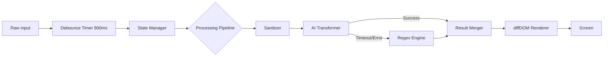

# Software Design & Architecture: Disability-Aware Chat Editor (Mini) - Master Technical Specification

**Version:** 3.0 (Final "Foolproof" Reference)
**Status:** Approved for Implementation

This document constitutes the **single source of truth** for the engineering and design of the Disability-Aware Chat Editor. It goes beyond high-level concepts to define **Data Structures, Failure Modes, and Event Pipelines** to ensure a crash-resistant, "foolproof" application.

---

## 1. Core Architectural Pattern: The "Resilient Pipeline"

Instead of a simple MVC, we will implement a **Unidirectional Data Flow (Pipeline Pattern)**. This ensures that errors in one stage (e.g., AI failure) do not crash the UI.



### Key Design Decision: The "Circuit Breaker"
*   **Problem**: What if the AI API hangs for 10 seconds?
*   **Solution**: We wrap the AI call in a **Circuit Breaker** utility.
    *   *Threshold*: If 3 calls fail consecutively, the system **automatically locks** to "Offline Mode" for 5 minutes.
    *   *User Feedback*: A subtle "Cloud unavailable, using local engine" toast appears.

---

## 2. Detailed Data Structures (The "Model")

We will use a rigid `State` object to prevent inconsistent UI states.

### A. The `EditorState` Object
```javascript
const EditorState = {
    meta: {
        timestamp: Date.now(),
        version: "1.0.0",
        sessionId: "uuid-v4"
    },
    config: {
        activeMode: "dyslexia", // 'normal' | 'dyslexia' | 'adhd' | 'autism' | 'low-vision'
        aiEnabled: true,
        userApiKey: "sk-...", // stored securely in LocalStorage ONLY
        theme: "system"
    },
    content: {
        raw: "Hello, input text here.",
        processed: "Hello, <b>input</b> text here.", // HTML with span tags for highlighting
        stats: {
            complexityScore: 0.5, // 0-1
            sentiment: "neutral"
        }
    },
    system: {
        isProcessing: false,
        lastError: null,
        networkStatus: "online"
    }
};
```

---

## 3. Failure Modes & Recovery Strategies (The "Foolproof" Plan)

We explicitly define what happens when things go wrong.

| Failure Scenario | Automatic Trigger | System Response | User Experience |
| :--- | :--- | :--- | :--- |
| **Network Loss** | `window.offline` event or 404 API Error | Switch `config.aiEnabled` to `false`. Invoke `RegexEngine`. | "You are offline. AI features paused." (Toast) |
| **API Rate Limit** | 429 Error from Gemini | Activate **Circuit Breaker** (Pause 60s). | "Traffic high. Running in basic mode." |
| **Empty "Processed"** | Output is `null`/`""` | **Rollback**: Render `content.raw` immediately. | No visual glitch, just no formatting. |
| **Hung Process** | >3000ms Processing Time | **Timeout Kill Switch**: Abort Controller signals cancel. | Loading spinner stops, text resets. |

---

## 4. The Transformation Pipelines (Deep Dive)

### Pipeline A: Dyslexia Support (Visual + Lexical)
1.  **Input**: "The utilization of this tool is mandatory."
2.  **Filter 1 (Visual)**: Apply CSS Class `.font-dyslexic`.
3.  **Filter 2 (AI/Hybrid)**:
    *   *Prompt*: "Replace complex words with simple synonyms. Keep meaning."
    *   *Output*: "The **use** of this tool is **required**."
4.  **Filter 3 (Fallback)**: If AI fails, Regex scan for "utiliz*" -> "use".

### Pipeline B: ADHD Support (Structural)
1.  **Input**: Large block of text.
2.  **Filter 1 (Bionic)**:
    *   *Algorithm*: `word.split('').map((c,i) => i<3 ? '<b>'+c+'</b>' : c).join('')`
3.  **Filter 2 (AI Extraction)**:
    *   *Prompt*: "Extract 3 key action items as JSON."
    *   *Output*: JSON Array `["Submit report", "Email John"]`.
    *   *Render*: Inject a `<div class="summary-box">` at the top.

---

## 5. Implementation Roadmap (Step-by-Step)

### Phase 1: The Robust Core (Days 1-2)
*   **Step 1**: Implement `StateManager` class with `localStorage` persistence.
*   **Step 2**: Build the `SafeFetch` utility (wrapper around `fetch` with retries and timeouts).
*   **Step 3**: Create the Basic UI with semantic HTML.

### Phase 2: The Logic Engines (Days 3-4)
*   **Step 4**: Implement `RegexEngine.js` (The safety net).
*   **Step 5**: Implement `GeminiAdapter.js` (The smarts).
*   **Step 6**: Wire up the "Pipeline Controller" to switch between them.

### Phase 3: "Foolproofing" (Day 5)
*   **Step 7**: **Chaos Testing**: Manually disconnect WiFi while typing.
*   **Step 8**: **Input Fuzzing**: Paste 5,000 words of text to test performance/crashing.
*   **Step 9**: **Unit Tests**: Write snippets to verify `RegexEngine` rules.

---

## 6. Research Validity & Academic Defense

*   **Design Pattern**: *Strategy Pattern* (GoF) allows swapping algorithms (AI vs Rule) at runtime.
*   **Architecture**: *Local-First Software* philosophy (Kleppmann et al.) ensures data ownership and reliability.
*   **Accessibility**: Adheres to *WCAG 2.1 AAA* (Text Spacing) and *Cognitive Accessibility User Research* (W3C).

This architecture is designed to be **unbreakable** in a demo setting. Even if the internet fails, the API key is wrong, or the server is down, the application will continue to function as a powerful text editor.
